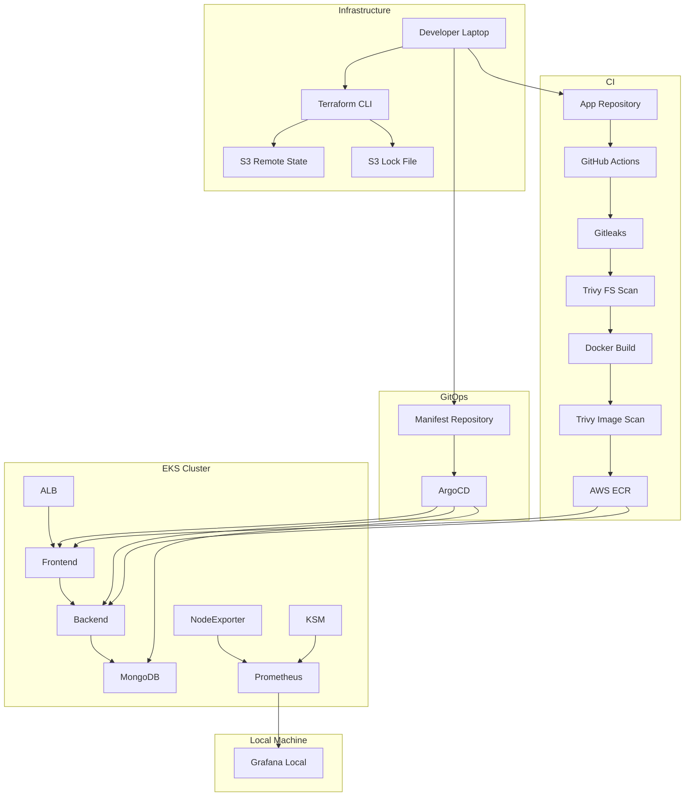

## Architecture

## Repository Visibility
- **Application Repository**: Public
- **Manifest Repository**: [TO-DO-APP-CONFIGS](https://github.com/Viggy06/TO-DO-APP-CONFIGS)  
  _(GitOps configuration and Kubernetes cluster manifests)_
- **Terraform Repository**: [Terraform-Infra-Repo](https://github.com/Viggy06/TO-DO-APP-Terraform)
  _(Infrastructure provisioning and remote state configuration)_
