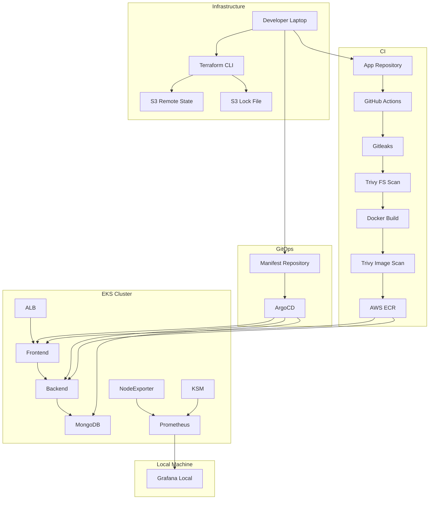

## 🏗️ Architecture Overview

This project implements a complete **DevSecOps Lifecycle** for a **Three-Tier-Application**. It integrates infrastructure provisioning, automated security scanning, GitOps-driven deployments, and cluster observability.

### System Architecture

The workflow is divided into five functional layers:
* **Infrastructure:** AWS resources provisioned via **Terraform** with S3 remote state locking.
* **CI Pipeline:** **GitHub Actions** workflows featuring **Gitleaks** and **SonarQube** , **Trivy** for security.
* **Container Registry:** Secure image storage in **Amazon ECR**.
* **Continuous Deployment:** GitOps-based delivery using **ArgoCD** to sync manifests.
* **EKS Cluster:** A multi-tier app (Frontend/Backend/MongoDB) monitored by **Prometheus** and **Grafana**.

## Architecture

## Repository Visibility
- **Application Repository**: Public
- **Manifest Repository**: - Private (GitOps configuration and cluster details)
- **Terraform Repository**:  Private (infrastructure provisioning and state configuration)
